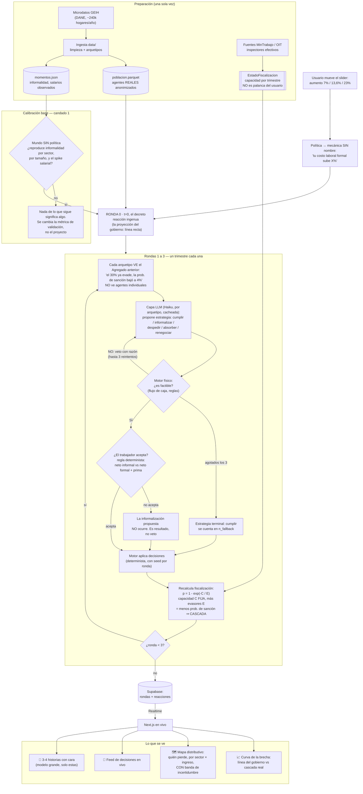
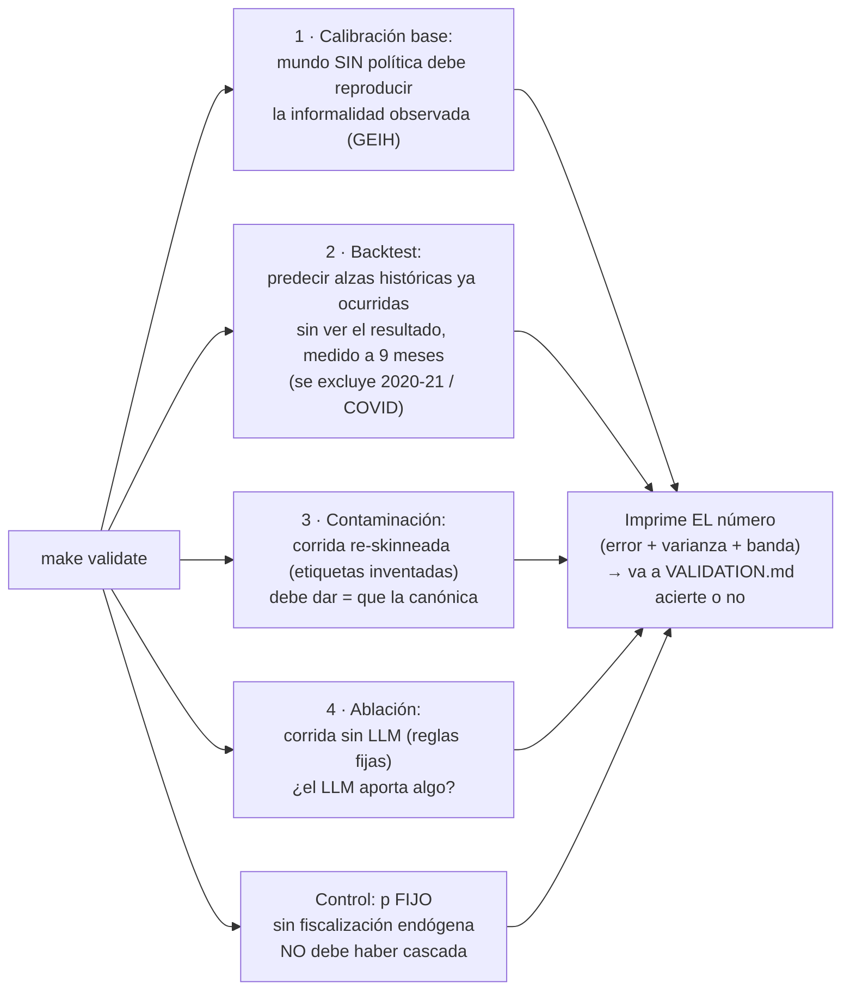

# Diagrama de flujo — cómo funciona la simulación

> Renderiza directo en GitHub (Mermaid). Dos flujos: el de una **corrida** (lo que ve el
> usuario) y el de **validación** (lo que ve el juez con `make validate`).
>
> **Actualizado 2026-08-22 (R2)** con el reloj de [ADR 0005](adr/0005-el-reloj-de-la-simulacion.md),
> la separación de [ADR 0006](adr/0006-fiscalizacion-es-estado-del-mundo.md), la forma
> funcional de [ADR 0007](adr/0007-forma-funcional-prob-sancion.md) y la asimetría de
> [ADR 0008](adr/0008-asimetria-firma-trabajador.md) 🔶.

## Flujo principal: una corrida

**Una ronda es un trimestre. El horizonte son nueve meses desde el decreto.**

## Flujo de validación: `make validate`

**La corrida de control con `p` fijo** es nueva y es barata: si la cascada aparece igual sin
fiscalización endógena, entonces viene de otra parte y hay que saberlo antes del pitch, no
durante el Q&A ([ADR 0007](adr/0007-forma-funcional-prob-sancion.md)).

## Los tres momentos clave, en una línea cada uno

**El veto es la interfaz entre la creatividad y la física.** El LLM inventa lo que un
economista no enumeraría; el motor determinista mata lo que la plata no permite. Lo que
sobrevive a ambos filtros es lo que ningún otro método produce.

**El trabajador es el segundo filtro, y es aritmético.** Una firma puede querer informalizar
y no lograrlo. Cuánta informalización propuesta **no ocurre** es un resultado del modelo, no
un veto, y es dato para el mapa distributivo.

**La cascada nace de una división.** La capacidad de inspección `C` es fija; los evasores `E`
crecen. `p = 1 − exp(−C/E)` cae, y cada caída hace que evadir sea más barato para el
siguiente. Nadie programó "si muchos evaden, evade más": sale de repartir un número fijo de
inspecciones entre un número creciente de infractores.
