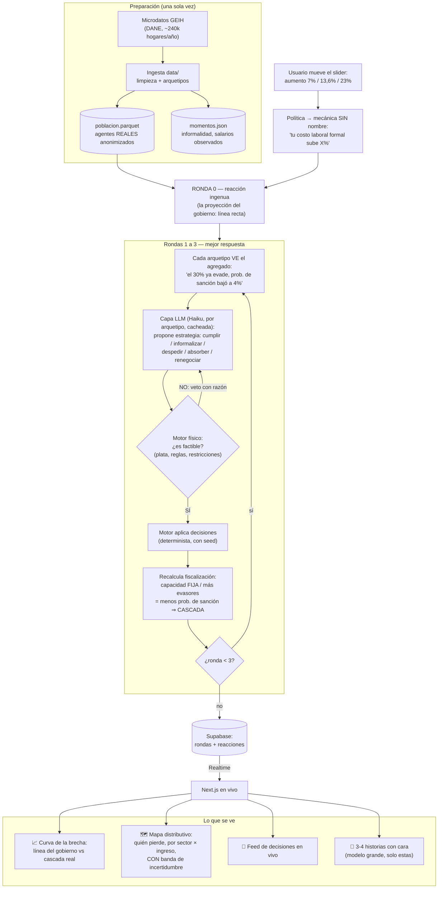
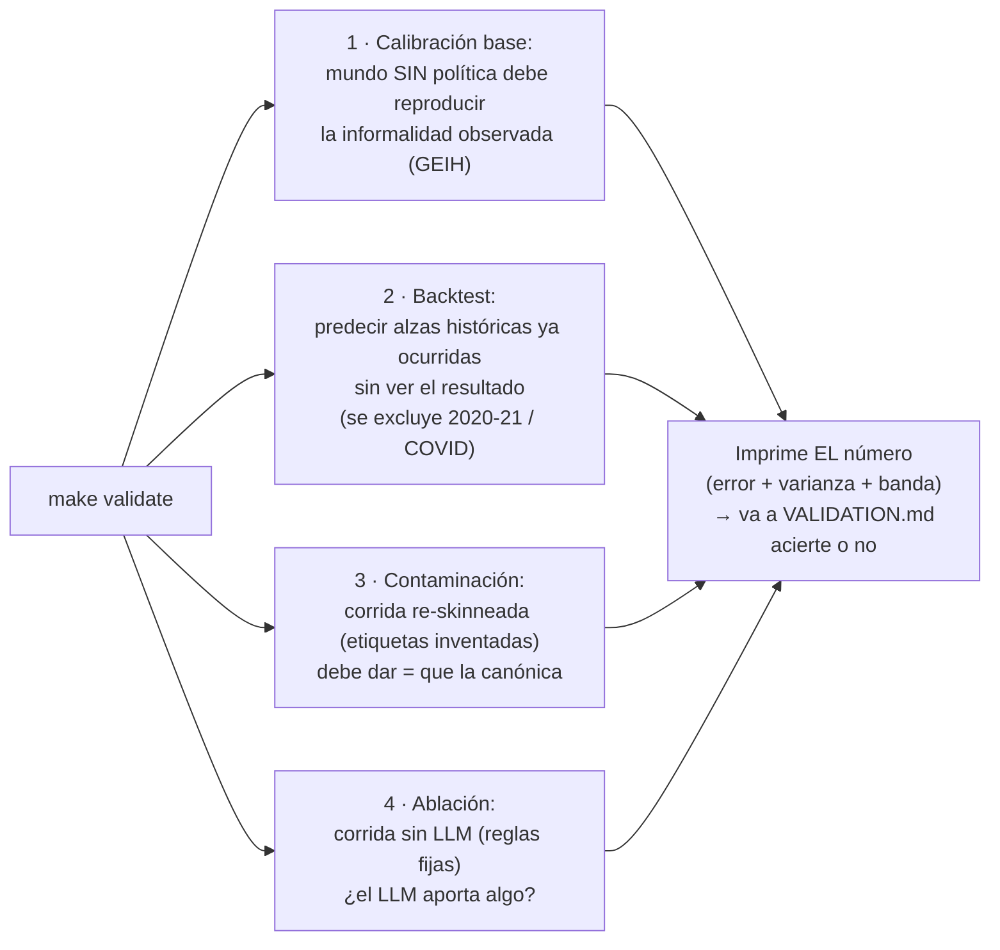

# Diagrama de flujo — cómo funciona la simulación

> Renderiza directo en GitHub (Mermaid). Dos flujos: el de una **corrida** (lo que ve el usuario) y el de **validación** (lo que ve el juez con `make validate`).

## Flujo principal: una corrida

## Flujo de validación: `make validate`

## El momento clave, en una línea

**El veto es la interfaz entre la creatividad y la física:** el LLM inventa lo que un economista no enumeraría; el motor determinista mata lo que la plata no permite. Lo que sobrevive a ambos filtros es lo que ningún otro método produce.
