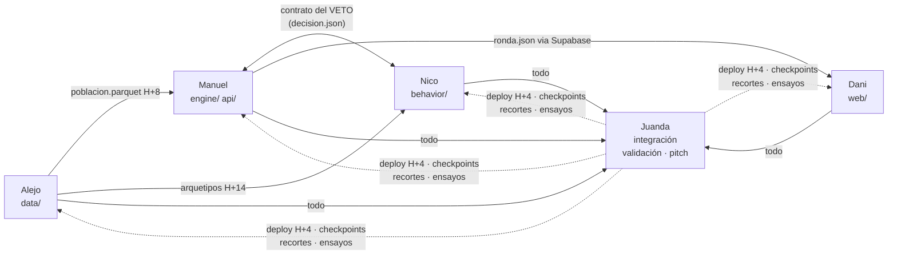

# Roles del equipo — quién hace qué, en qué carpeta, en qué rama

> Cada quien trabaja en **su propia sesión de Claude Code**, sobre **su rama**, dentro de **sus carpetas**.
> Referencia obligada antes de arrancar: `docs/PLAN.md` (el plan completo) · `docs/UML.md` · `docs/FLUJO.md`.
> Los contratos de datos (`docs/PLAN.md` §4) se congelan en H+4 — después de eso, cambiar un contrato requiere avisar en el grupo ANTES de tocar nada.

## Mapa de asignación

| Quién | Rol | Carpetas (dueño exclusivo) | Rama |
|---|---|---|---|
| **Alejo** | R1 · Datos / población | `data/`, `contracts/` | `rol/datos` |
| **Manuel** | R2 · Backend: motor + API | `engine/`, `api/` | `rol/backend` |
| **Nico** | R3 · Conductual + equilibrio | `behavior/` | `rol/conductual` |
| **Dani** | R4 · Diseño e interfaz | `web/` | `rol/interfaz` |
| **Juanda** | R5 · Integración / validación / pitch | `tests/`, `scripts/`, docs raíz (`README`, `AGENTS`, `ARCHITECTURE`, `VALIDATION`), `Makefile`, deploy | `rol/integracion` |

## Reglas de convivencia (de `docs/PLAN.md` §7 — no negociables)

1. **Un dueño por carpeta.** Nadie toca la carpeta de otro sin avisar. Los agentes de código respetan límites de carpeta mejor que acuerdos verbales — díselo a tu Claude en el primer mensaje.
2. **Contratos congelados en H+4.** Hasta que el dato real llegue, todos construyen contra los ejemplos concretos de `docs/PLAN.md` §4 (`agente.json`, `decision.json`, `ronda.json`) — nunca contra un tipo vacío.
3. **El reporte de un agente es un reclamo, no evidencia.** `git diff --stat` antes de creer que algo se hizo.
4. Cada 6 horas, 10 minutos de pie: qué corre, qué está roto, qué necesito de ustedes.
5. Algo trabado 2 horas → se corta y se hardcodea. Los `# SUPUESTO:` se escriben en el momento, no al final.

---

## Alejo — R1 · Datos / población

**Misión:** que a la H+8 exista `data/poblacion.parquet` con agentes REALES de la GEIH. Eres el camino crítico: sin esto no hay proyecto.

**Entregables:**
- **H+2 (checkpoint C1):** archivo crudo de la GEIH en disco (registro en `microdatos.dane.gov.co`, catálogos 2022–2026). Si no baja → plan B en ese momento: tablas agregadas del DANE de descarga directa. **Se cambia de fuente, no de proyecto.**
- **H+4:** `contracts/*.json` congelados con ejemplos reales (con Manuel y Nico).
- **H+8:** `data/poblacion.parquet` (esquema = `contracts/agente.json`: id, sector, tamaño de empresa, ingreso, formal, educación, factor de expansión, arquetipo) + `data/momentos.json` (informalidad por sector y tamaño, distribución salarial — los objetivos de calibración).
- **H+6:** verificación V2 (¿el panel rotativo permite seguir personas entre trimestres?) — valioso, no bloqueante.
- `data/README.md`: fuente exacta, fecha de descarga, transformaciones. El agente del juez lo va a leer.

**Dependencias:** nadie te bloquea; tú bloqueas a todos. Publica el esquema ANTES de tener los datos.
**No tocar:** `engine/`, `behavior/`, `web/`.

**Arranque de tu sesión de Claude Code:**
> Lee docs/PLAN.md (secciones 4, 6) y docs/ROLES.md (mi sección: Alejo). Soy dueño de data/ y contracts/, rama rol/datos. Mi primera tarea: registrarme en microdatos.dane.gov.co, descargar la GEIH más reciente con el módulo de informalidad, y construir data/poblacion.parquet según contracts/agente.json. No toques ninguna otra carpeta.

---

## Manuel — R2 · Backend: motor + API

**Misión:** el corazón determinista en `engine/` (~300 líneas de numpy/pandas que el juez debe poder leer en una tarde) y la API que lo expone.

**Entregables:**
- **H+4:** contratos congelados (con Alejo y Nico) + primer commit del motor **con seed y determinismo desde el inicio** (meterlo después es reescribir).
- **H+10 (checkpoint C3):** el motor corre punta a punta con datos falsos: población fake → 4 rondas → agregados por ronda.
- Piezas del motor: costos formal/informal (factor prestacional — verificación V3, H+4: si no hay cifra exacta, rango 1,4–1,5 con `# SUPUESTO:` y sensibilidad) · probabilidad de fiscalización endógena (capacidad fija / evasores — la cascada) · **el veto de factibilidad** (la interfaz con la capa de Nico) · scheduler de rondas · **barrido de `aumento_pct`** para localizar el codo (dato A2 del plan).
- `api/`: FastAPI con `POST /simulaciones` que corre el motor y persiste cada ronda en Supabase.
- `engine/README.md` + docstring de cabecera en cada archivo: qué modela, entradas, salidas, supuestos.

**Dependencias:** esquema de Alejo (trabaja con datos falsos hasta H+8) · el contrato del veto con Nico.
**No tocar:** el LLM (eso es de Nico), `web/`, `data/`.

**Arranque de tu sesión de Claude Code:**
> Lee docs/PLAN.md (secciones 4, 4.1, 4.2, 5) y docs/ROLES.md (mi sección: Manuel). Soy dueño de engine/ y api/, rama rol/backend. Motor vectorizado en numpy/pandas — NO usar Mesa ni frameworks de ABM (decisión 4.1 del plan). Determinismo con seed desde el primer commit. Empiezo por el modelo de costos y el veto de factibilidad contra contracts/decision.json. No toques behavior/, web/ ni data/.

---

## Nico — R3 · Conductual + equilibrio

**Misión:** la capa LLM que descubre estrategias y el bucle de rondas de mejor respuesta. **Y eres quien defiende "mejor respuesta" y "equilibrio de Nash" en el Q&A** — construir esto ES tu preparación (aparta 1–2 horas con material de Daniel/insumos antes del domingo).

**Entregables:**
- **H+3 (verificación V10):** abrir el repo de AgentTorch: ¿hay algo importable para el muestreo por arquetipos? Si no (probable), se implementa a mano: ~50 líneas.
- **H+10:** prompts por arquetipo funcionando contra el motor de Manuel con datos falsos. Regla de oro: **al LLM solo la mecánica, NUNCA el nombre de la política** (control de contaminación, §5.3 del plan).
- Piezas: definición de arquetipos (sector × tamaño × formal/informal × tramo de ingreso, ~40–60) · llamadas por arquetipo con **Haiku** + prompt caching · **caché en disco por hash del prompt** · **presupuesto tope por corrida con corte duro** · bucle de rondas: propuesta → veto de Manuel → reintento → agregado · modelo grande SOLO para las 3–4 historias narradas.
- **H+20–26 (si C4 cerró):** el test de pico y placa (§5.5 del plan, con Juanda): solo la mecánica, ¿emerge el segundo carro?

**Dependencias:** el contrato del veto con Manuel · arquetipos definidos con Alejo (H+14).
**No tocar:** `engine/` (propones decisiones, no las aplicas), `web/`, `data/`.

**Arranque de tu sesión de Claude Code:**
> Lee docs/PLAN.md (secciones 3-D4, 4, 5) y docs/ROLES.md (mi sección: Nico). Soy dueño de behavior/, rama rol/conductual. LLM por arquetipo con Haiku + prompt caching + caché en disco + tope de presupuesto. Los prompts describen SOLO mecánica, jamás el nombre de la política. Produzco contracts/decision.json y consumo el veto de engine/. No toques engine/, web/ ni data/.

---

## Dani — R4 · Diseño e interfaz

**Misión:** que el mundo se vea moverse. La interfaz ES el 20% de impacto: un extraño con el link (voto público) tiene que entenderla sin manual y sin registrarse.

**Entregables:**
- **H+4:** esqueleto Next.js desplegado (con Juanda) — feo está bien, desplegado es obligatorio.
- **H+10 (C3):** la corrida punta a punta se VE: slider dispara simulación, la curva se dibuja.
- Los cuatro elementos, mapeados a los datos del plan (§1.1): **curva de la brecha** (línea del gobierno vs cascada, rondas 0→3 — la imagen del pitch) · **slider** de política (7/13,6/23% + barrido del codo precomputado — A2) · **mapa distributivo** por sector × ingreso con bandas de incertidumbre (A3) · **desglose de estrategias** por segmento (A4) + feed Realtime de decisiones + 3–4 historias con cara.
- **H+20–28:** pulido visual y narrativa de la demo. Nada de features nuevos después de H+28.

**Dependencias:** `contracts/ronda.json` (construye contra el ejemplo desde H+4 con datos falsos — no esperes a nadie) · Supabase Realtime (esquema con Manuel).
**No tocar:** `engine/`, `behavior/`, `data/`, docs raíz.

**Arranque de tu sesión de Claude Code:**
> Lee docs/PLAN.md (secciones 1.1, 4) y docs/ROLES.md (mi sección: Dani). Soy dueño de web/, rama rol/interfaz. Next.js + Supabase Realtime. Construyo contra contracts/ronda.json con datos falsos desde ya. Los 4 elementos en orden: curva de la brecha, slider con barrido, mapa distributivo con bandas, desglose de estrategias. Sin auth, sin registro: un extraño debe usarlo directo. No toques engine/, behavior/ ni data/.

---

## Juanda — R5 · Integración / validación / pitch

**Misión:** que el proyecto no muera en la hora 34. **No escribes features** — por diseño: eres el único que puede ver el todo. Arbitras los recortes en cada checkpoint.

**Entregables:**
- **H+1:** conectar Render/Vercel al repo espejo (`vibe-coders-team/platanus-hack-26-T16-simulations` — el doble push ya está configurado) · búsqueda de prior art de 20 min (V6) · `README.md` y `AGENTS.md` con la idea, ANTES del código.
- **Cena (~H+2):** las preguntas al mentor (V5 del plan: hora de presentaciones, freeze por commit o rama, y la de Daniel: ¿un backtest negativo pero honesto puntúa como ejecución seria?).
- **H+4 (C2):** hola-mundo desplegado que abre desde el celular de otro.
- **H+6:** serie histórica de alzas del salario mínimo 2000–2026 en un CSV (V4). **H+8–10:** V8 (elasticidades) y V9 (spike salarial en la GEIH, con Alejo).
- **H+20–26 (C5):** el backtest corre y **existe el número de validación** — se publica sea bueno o malo. `VALIDATION.md` completo (metodología, número, límites admitidos, control de contaminación).
- `Makefile` (`make run/test/validate` — validate imprime EL número) · `scripts/reproduce.py` · tests del núcleo con Manuel.
- **H+28+:** video de respaldo ANTES de pulir nada · deploy final probado desde celular con datos móviles sin sesión · guion del pitch (§12 del plan) y mínimo 5 ensayos cronometrados.

**Dependencias:** todos — por eso no tienes features propias.
**No tocar:** `engine/`, `behavior/`, `web/`, `data/` (los lees, no los editas; los tests sí son tuyos).

**Arranque de tu sesión de Claude Code:**
> Lee docs/PLAN.md completo y docs/ROLES.md (mi sección: Juanda). Soy dueño de tests/, scripts/, Makefile y los docs raíz (README, AGENTS, ARCHITECTURE, VALIDATION), rama rol/integracion. No escribo features. Primeras tareas: conectar Render/Vercel al repo espejo, prior art 20 min, README+AGENTS.md con la idea. Mi entregable estrella: make validate imprimiendo el número del backtest. No edito engine/, behavior/, web/ ni data/.

---

## Dependencias entre roles, en un vistazo

**Camino crítico:** Alejo (H+2 GEIH → H+8 parquet). **Punto único de falla:** los microdatos — con plan B ya escrito (PLAN.md §6, V1).
