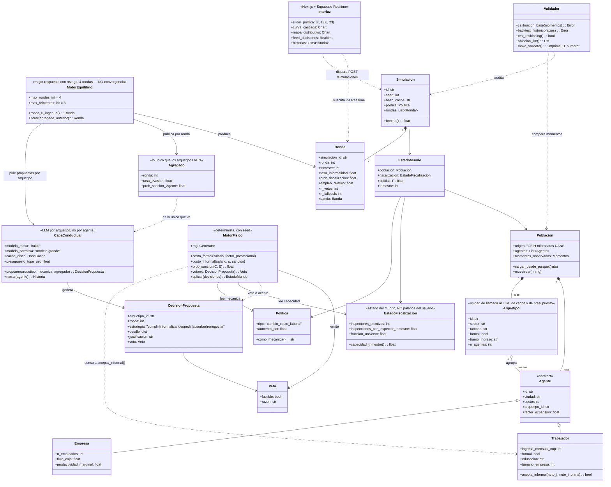

# UML — Estructura de la idea

> Diagrama de clases del dominio. Renderiza directo en GitHub (Mermaid).
> Corresponde a los contratos de `docs/PLAN.md` §4 (`agente.json`, `decision.json`,
> `ronda.json`) y a las decisiones de [`docs/IDEA.md`](IDEA.md).
>
> **Actualizado 2026-08-22 (R2)** con [ADR 0005](adr/0005-el-reloj-de-la-simulacion.md) ·
> [0006](adr/0006-fiscalizacion-es-estado-del-mundo.md) ·
> [0007](adr/0007-forma-funcional-prob-sancion.md) ·
> [0008](adr/0008-asimetria-firma-trabajador.md) 🔶 ·
> [0009](adr/0009-frontera-del-determinismo.md).

## Lectura del diagrama en seis frases

1. **`Poblacion`** no se genera: se **carga** desde la GEIH. Por eso `Trabajador` tiene los
   atributos de la encuesta y `factor_expansion` para escalar a la ciudad.
2. El bucle central es `MotorEquilibrio → CapaConductual → DecisionPropuesta →
   MotorFisico.vetar()`: **el LLM propone, el motor determinista dispone.** Ninguna decisión
   no factible sobrevive, y tras tres vetos la estrategia terminal es cumplir.
3. **`Politica.como_mecanica()`** es el control de contaminación hecho código: el LLM solo ve
   la mecánica (*"tu costo laboral sube X%"*), nunca el nombre.
4. **`EstadoFiscalizacion` está separada de `Politica` a propósito**
   ([ADR 0006](adr/0006-fiscalizacion-es-estado-del-mundo.md)). La capacidad de inspección es
   un dato del mundo con fuente, no una perilla del usuario. Si fuera perilla, cualquier
   resultado sería alcanzable y la cascada no probaría nada.
5. **`Arquetipo` y `Agregado` son entidades de primera clase.** El arquetipo es la unidad de
   llamada al LLM, de caché y de presupuesto. El agregado es **lo único que los arquetipos
   ven**, y por eso la interacción es indirecta: ahí nace la cascada sin costo cuadrático.
6. **`Simulacion.brecha()`** — la distancia entre la ronda 0 (lo que el gobierno proyecta) y
   la ronda 3 (la cascada, nueve meses después) — **es el producto entero**.

## Lo que el diagrama declara que NO hay

- **No hay `Aprendizaje`.** Los agentes no acumulan memoria entre rondas más allá del agregado.
- **No hay `Prediccion`.** Nadie anticipa rondas futuras. Es mejor respuesta miope, y es
  exactamente por qué esto no se llama equilibrio.
- **No hay red ni geografía.** La interacción es indirecta vía `Agregado`. El caso no es espacial.
