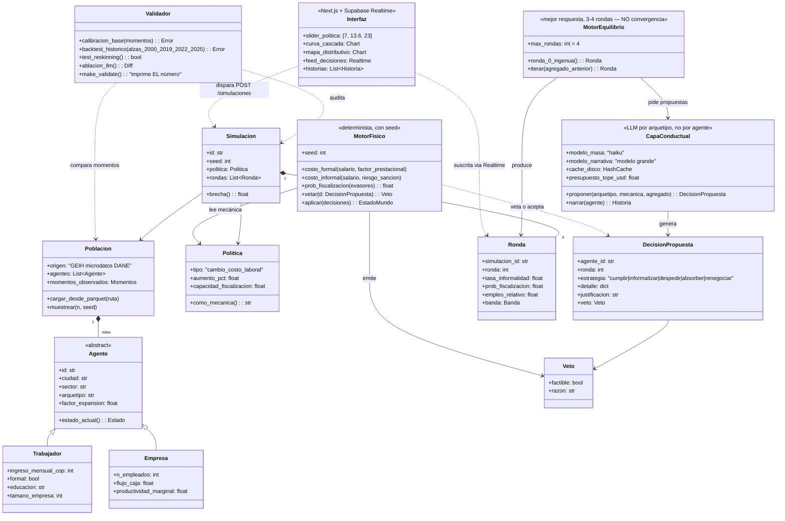

# UML — Estructura de la idea

> Diagrama de clases del dominio. Renderiza directo en GitHub (Mermaid).
> Corresponde a los contratos de `docs/PLAN.md` §4: `agente.json`, `decision.json`, `ronda.json`.

## Lectura del diagrama en 4 frases

1. **`Poblacion`** no se genera: se **carga** desde la GEIH — por eso `Trabajador` tiene los atributos de la encuesta y `factor_expansion` para escalar a la ciudad.
2. El bucle central es `MotorEquilibrio → CapaConductual → DecisionPropuesta → MotorFisico.vetar()`: el LLM propone, el motor determinista dispone. Ninguna decisión no factible sobrevive.
3. **`Politica.como_mecanica()`** es el control de contaminación hecho código: el LLM solo ve la mecánica ("tu costo laboral sube X%"), nunca el nombre.
4. **`Simulacion.brecha()`** — la distancia entre la ronda 0 (lo que el gobierno proyecta) y la ronda 3 (la cascada) — es el producto entero.
